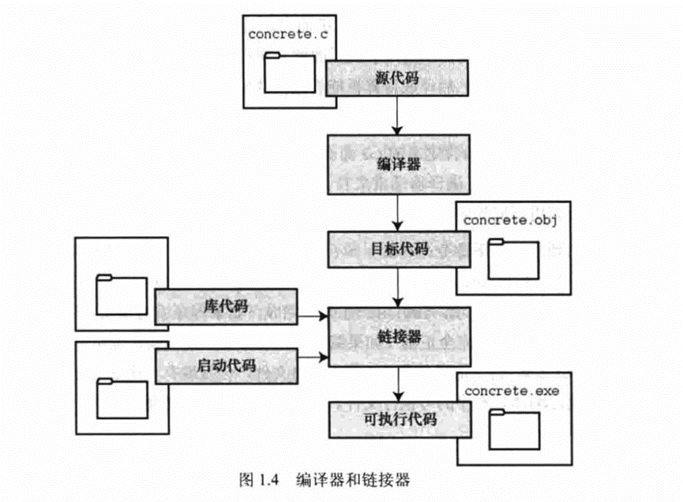
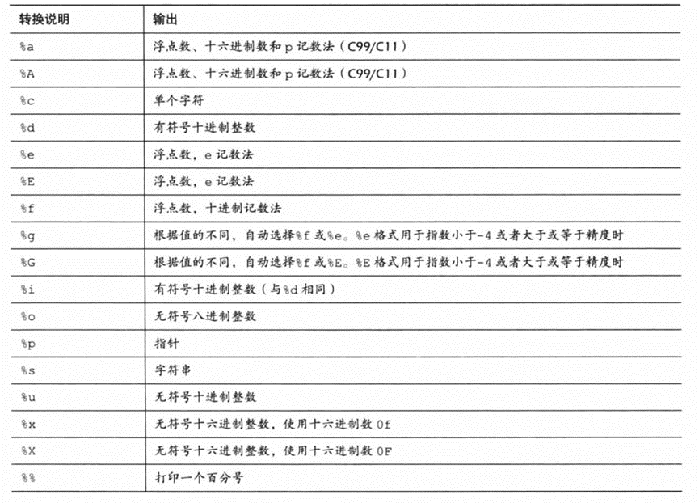

# C程序结构

主要包括一下几个部分：

- 预处理器指令

- 函数

- 变量

- 语句&表达式

- 注释

```c
#include <stdio.h>

int main()
{

/*输出hello*/
printf("hello");

return 0;
}
```


# 编译&执行



```shell
$ gcc hello.c

$ ./a.out

Hello, World!

$ gcc test1.c test2.c -o main.out

$ ./main.out
```

# 关键字

| 关键字   | 说明                                                          |
|----------|---------------------------------------------------------------|
| auto     | 声明自动变量                                                  |
| break    | 跳出当前循环                                                  |
| case     | 开关语句分支                                                  |
| char     | 声明字符型变量或函数返回值类型                                |
| const    | 定义常量，如果一个变量被 const 修饰，那么它的值就不能再被改变 |
| continue | 结束当前循环，开始下一轮循环                                  |
| default  | 开关语句中的"其它"分支                                        |
| do       | 循环语句的循环体                                              |
| double   | 声明双精度浮点型变量或函数返回值类型                          |
| else     | 条件语句否定分支（与 if 连用）                                |
| enum     | 声明枚举类型                                                  |
| extern   | 声明变量或函数是在其它文件或本文件的其他位置定义              |
| float    | 声明浮点型变量或函数返回值类型                                |
| for      | 一种循环语句                                                  |
| goto     | 无条件跳转语句                                                |
| if       | 条件语句                                                      |
| int      | 声明整型变量或函数                                            |
| long     | 声明长整型变量或函数返回值类型                                |
| register | 声明寄存器变量                                                |
| return   | 子程序返回语句（可以带参数，也可不带参数）                    |
| short    | 声明短整型变量或函数                                          |
| signed   | 声明有符号类型变量或函数                                      |
| sizeof   | 计算数据类型或变量长度（即所占字节数）                        |
| static   | 声明静态变量                                                  |
| struct   | 声明结构体类型                                                |
| switch   | 用于开关语句                                                  |
| typedef  | 用以给数据类型取别名                                          |
| unsigned | 声明无符号类型变量或函数                                      |
| union    | 声明共用体类型                                                |
| void     | 声明函数无返回值或无参数，声明无类型指针                      |
| volatile | 说明变量在程序执行中可被隐含地改变                            |
| while    | 循环语句的循环条件                                            |

**C99 新增关键字**

| \_Bool | \_Complex | \_Imaginary | inline | restrict |
|--------|-----------|-------------|--------|----------|

**C11 新增关键字**

| \_Alignas       | \_Alignof      | \_Atomic | \_Generic | \_Noreturn |
|-----------------|----------------|----------|-----------|------------|
| \_Static_assert | \_Thread_local |          |           |            |

- 数据类型
  - 基本数据类型（算术类型） int char long float double
  - 枚举类型 （算术类型） 定义程序中只能赋予其一定的离散整数值的变量
  - Void类型 没有值的返回类型
  - 派生类型 数值类型 指针类型 结构体类型

不同的系统，存储大小不同

```text
%lu 为32位无符号整数

以十进制显示数字， 使用％d: 以八进制显示数字， 使用％o: 以十六进制显示数字， 使用\*X。

printf("int 存储大小%lu \n",sizeof(int));

printf("long 存储大小 %lu \n",sizeof(long));

int 存储大小4

long 存储大小 4

%E为以指数形式输出单，双精度实数
```



**Void类型**

1.  函数返回为空 例如 **void exit (int status);**

2.  函数参数为空 例如 **int rand (void);**

3.  指定指向void 类型为void \* 的指针代表对象的地址，而不是类型，例如，内存分配函数 **void \*malloc( size_t size );** 返回指向 void 的指针，可以转换为任何数据类型。

**类型转换**

隐式转换：

```c
int i = 10;
float f = 3.14;
double d = i + f; // 隐式将int类型转换为double类型
```

显示转换：

```c
double d = 3.14159;
int i = (int)d; // 显式将double类型转换为int类型
```


# 变量

C 语言中变量的默认值取决于其类型和作用域。全局变量和静态变量的默认值为 0，字符型变量的默认值为 \0，指针变量的默认值为 NULL，而局部变量没有默认值，其初始值是未定义的。

**变量的声明**

1、一种是需要建立存储空间的。例如：int a 在声明的时候就已经建立了存储空间。

2、另一种是不需要建立存储空间的，通过使用extern关键字声明变量名而不定义它。 例如：extern int a 其中变量 a 可以在别的文件中定义的。

3、除非有extern关键字，否则都是变量的定义。

# 常量

**整数常量**

整数常量也可以带一个后缀，后缀是 U 和 L 的组合，U 表示无符号整数（unsigned），L 表示长整数（long）。后缀可以是大写，也可以是小写，U 和 L 的顺序任意。

```c
int myInt = 10;
long myLong = 100000L;
unsigned int myUnsignedInt = 10U;
```

**浮点常量**

```c
3.14159 /* 合法的 */
314159E-5L /* 合法的 */
510E /* 非法的：不完整的指数 */
210f /* 非法的：没有小数或指数 */
.e55 /* 非法的：缺少整数或分数 */
```

**字符常量**

字符常量是括在单引号中，例如，'x' 可以存储在 char 类型的简单变量中。

字符常量可以是一个普通的字符（例如 'x'）、一个转义序列（例如 '\t'），或一个通用的字符（例如 '\u02C0'）。

在 C 中，有一些特定的字符，当它们前面有反斜杠时，它们就具有特殊的含义，被用来表示如换行符（\n）或制表符（\t）等。

**字符常量的 ASCII 值可以通过强制类型转换转换为整数值。**

```c
char myChar = 'a';
int myAsciiValue = (int) myChar; // 将 myChar 转换为 ASCII 值 97
```

**字符串常量**

括在双引号” ”中的，下面着三种形式字符串是相同的

```c
"hello, dear"
"hello, \\
dear"
"hello, " "d" "ear"
```

字符串常量在内存中以 null 终止符 \0 结尾。例如：

```c
char myString\[\] = "Hello, world!"; //系统对字符串常量自动加一个 '\0'
```

**定义常量**

使用#define预处理器：#define 可以在程序中定义一个常量，它在编译时会被替换为其对应的值。

使用const关键字：const 关键字用于声明一个只读变量，即该变量的值不能在程序运行时修改。不是常量

**\#define预处理器**

```c
#define 常量名 常量值

#define PI 3.14159
```

在程序中使用该常量时，编译器会将所有的 PI 替换为 3.14159。

**const关键字**

const 数据类型 常量名 = 常量值;

const int MAX_VALUE = 100;

示例：

```c
#include <stdio.h>
int main(){
const int LENGTH = 10;
const int WIDTH = 5;
const char NEWLINE = '\n';
int area;
area = LENGTH * WIDTH;
printf("value of area : %d", area);
printf("%c", NEWLINE);
return 0;
}
```

**\#define与const区别**

\#define 与 const 这两种方式都可以用来定义常量，选择哪种方式取决于具体的需求和编程习惯。通常情况下，建议使用 const 关键字来定义常量，因为它具有类型检查和作用域的优势，而 \#define 仅进行简单的文本替换，可能会导致一些意外的问题。

替换机制：#define 是进行简单的文本替换，而 const 是声明一个具有类型的常量。#define 定义的常量在编译时会被直接替换为其对应的值，而 const 定义的常量在程序运行时会分配内存，并且具有类型信息。

类型检查：#define 不进行类型检查，因为它只是进行简单的文本替换。而 const 定义的常量具有类型信息，编译器可以对其进行类型检查。这可以帮助捕获一些潜在的类型错误。

作用域：#define 定义的常量没有作用域限制，它在定义之后的整个代码中都有效。而 const 定义的常量具有块级作用域，只在其定义所在的作用域内有效。

调试和符号表：使用 \#define 定义的常量在符号表中不会有相应的条目，因为它只是进行文本替换。而使用 const 定义的常量会在符号表中有相应的条目，有助于调试和可读性。

# 存储类

存储类定义 C 程序中变量/函数的存储位置、生命周期和作用域。

1.  auto

2.  register

3.  static

4.  extern

## auto

## register

## static

## extern

# 指针

## 简介

指针是什么？首先，它是一个值，这个值代表一个内存地址，因此指针相当于指向某个内存地址的路标。

字符\*表示指针，通常跟在类型关键字的后面，表示指针指向的是什么类型的值

比如，char\*表示一个指向字符的指针，float\*表示一个指向float类型的值的指针

星号\*可以放在变量名与类型关键字之间的任何地方，下面的写法都是有效的。

int \*intPtr;

int \* intPtr;

int\* intPtr;

一个指针指向的可能还是指针，这时就要用两个星号\*\*表示。

int\*\* foo;

上面示例表示变量foo是一个指针，指向的还是一个指针，第二个指针指向的则是一个整数。

对 int \*intPtr说明

例如

/\* 在指针变量中存储的地址 \*/

printf("ip 变量存储的地址: %p\n", ip );

/\* 使用指针访问值 \*/

printf("\*ip 变量的值: %d\n", \*ip );

## &运算符

## NULL指针

如果没有确切的地址可以赋值，为指针变量赋一个 NULL 值是一个良好的编程习惯。赋为 NULL 值的指针被称为空指针。内存地址为0x0

if(ptr) /\* 如果 p 非空，则完成 \*/

if(!ptr) /\* 如果 p 为空，则完成 \*/

## void \*指针

void \* 是一个通用指针的数据类型，这个数据类型是一种特殊的指针类型，用来存储任何数据类型的地址。

void \*不关心指针指向的数据类型，只关心存储地址

常见用途：

1.  通用指针：当你需要处理不同数据类型的指针，但不知道具体的数据类型时，可以使用 void \* 来存储这些指针。这在某些通用数据结构或函数接口中非常有用。

2.  动态内存分配：在C中，动态内存分配函数如 malloc 返回的是 void \* 类型的指针。你可以将其强制类型转换为适当的指针类型，以便存储和访问特定类型的数据。

int \*intPtr;

intPtr = (int \*)malloc(sizeof(int));

3.  泛型编程：void \* 可用于实现泛型数据结构或算法，以使它们能够处理不同类型的数据。

4.  回调函数：当你需要在函数参数中传递函数指针，并且这些函数可以具有不同的参数和返回类型时，你可以使用 void \* 来传递指向不同函数的指针。

## 指针数组

指针数组：每个元素都是指向某种数据类型的指针。

指针数组存储了一组指针，每个指针可以指向不同的数据对象。

指针数组通常用于处理多个数据对象，例如字符串数组或其他复杂数据结构的数组。

### 整形指针数组

\#include \<stdio.h\>

const int MAX = 3;

int main ()

{

int var\[\] = {10, 100, 200};

int i, \*ptr\[MAX\];

for ( i = 0; i \< MAX; i++)

{

ptr\[i\] = &var\[i\]; /\* 赋值为整数的地址 \*/

}

for ( i = 0; i \< MAX; i++)

{

printf("Value of var\[%d\] = %d\n", i, \*ptr\[i\] );

}

return 0;

}

\*ptr\[i\] ------标识指针ptr\[i\]指向内存中存储的值，并非指针，也就是常说的解引用。

### 字符串指针数组

\#include \<stdio.h\>

const int MAX = 4;

int main ()

{

const char \*names\[\] = {

"Zara Ali",

"Hina Ali",

"Nuha Ali",

"Sara Ali",

};

int i = 0;

for ( i = 0; i \< MAX; i++)

{

printf("Value of names\[%d\] = %s\n", i, names\[i\] );

}

return 0;

}

为什么打印字符串不用\*names\[i\]来打印？

names 是一个指向常量字符串的指针数组，每个元素的类型是 const char \*。当你使用 \*names\[i\] 时，它表示解引用 names\[i\]，获取一个 const char 类型的字符，因此会导致类型不匹配的错误，因为 printf 期望一个字符串的地址。

const char 类型的字符表示单个字符，而不是一个字符串地址。在C语言中，字符串通常是由多个字符组成的字符数组，以一个空字符 '\0' 结尾。字符串的地址通常是一个 const char \* 或 char \* 类型的指针，指向第一个字符。所以 const char 是字符的数据类型，而 const char \* 才是指向字符串的地址的数据类型。

int x = 42;

int \*ptr = &x; // 声明一个整数指针 ptr，将其指向 x 的地址

int value = \*ptr; // 解引用 ptr，获取指针指向的值，即 x 的值

//解引用修改值

int qq=100;

int\* mm=&qq;

\*mm=99;

printf("qq :%d",qq);

printf("mm :%d",mm);

第一行输出qq为99

第二行输出 mm输出的则是指向99的地址

## 指针的算术运算

可以对指针进行四种算术运算：++、--、+、-。

假设 ptr 是一个指向地址 1000 的整型指针，是一个 32 位的整数，让我们对该指针执行下列的算术运算：

ptr++

在执行完上述的运算之后，ptr 将指向位置 1004，因为 ptr 每增加一次，它都将指向下一个整数位置，即当前位置往后移 4 字节。这个运算会在不影响内存位置中实际值的情况下，移动指针到下一个内存位置。如果 ptr 指向一个地址为 1000 的字符，上面的运算会导致指针指向位置 1001，因为下一个字符位置是在 1001。

我们概括一下：

1.  指针的每一次递增，它其实会指向下一个元素的存储单元。

2.  指针的每一次递减，它都会指向前一个元素的存储单元。

3.  指针在递增和递减时跳跃的字节数取决于指针所指向变量数据类型长度，比如 int 就是 4 个字节。

## 指向指针的指针


\#include \<stdio.h\>

int main ()

{

int V;

int \*Pt1;

int \*\*Pt2;

V = 100;

/\* 获取 V 的地址 \*/

Pt1 = &V;

/\* 使用运算符 & 获取 Pt1 的地址 \*/

Pt2 = &Pt1;

/\* 使用 pptr 获取值 \*/

printf("var = %d\n", V );

printf("Pt1 = %p\n", Pt1 );

printf("\*Pt1 = %d\n", \*Pt1 );

printf("Pt2 = %p\n", Pt2 );

printf("\*\*Pt2 = %d\n", \*\*Pt2);

return 0;

}

var = 100

Pt1 = 0x7ffee2d5e8d8

\*Pt1 = 100

Pt2 = 0x7ffee2d5e8d0

\*\*Pt2 = 100

## 传递指针给函数

\#include \<stdio.h\>

\#include \<time.h\>

 

void getSeconds(unsigned long \*par);

int main ()

{

   unsigned long sec;

   getSeconds( &sec );

   /\* 输出实际值 \*/

   printf("Number of seconds: %ld\n", sec );

   return 0;

}

void getSeconds(unsigned long \*par)

{

   /\* 获取当前的秒数 \*/

   \*par = time( NULL );

   return;

}

## 函数指针&回调函数

函数指针是指向函数的指针变量。

通常我们说的指针变量是指向一个整型、字符型或数组等变量，而函数指针是指向函数。

函数指针可以像一般函数一样，用于调用函数、传递参数。

函数指针变量的声明：

typedef int (\*fun_ptr)(int,int); // 声明一个指向同样参数、返回值的函数指针类型

\#include \<stdlib.h\>

\#include \<stdio.h\>

void populate_array(int \*array, size_t arraySize, int (\*getNextValue)(void))

{

for (size_t i=0; i\<arraySize; i++)

array\[i\] = getNextValue();

}

// 获取随机值

int getNextRandomValue(void)

{

return rand();

}

int main(void)

{

int myarray\[10\];

/\* getNextRandomValue 不能加括号，否则无法编译，因为加上括号之后相当于传入此参数时传入了 int , 而不是函数指针\*/

populate_array(myarray, 10, getNextRandomValue);

for(int i = 0; i \< 10; i++) {

printf("%d ", myarray\[i\]);

}

printf("\n");

return 0;

}

# 字符串

C语言中，字符串实际上使用空字符\0 结尾的一维字符数组。因此，\0 是用于标记字符串的结束。

空字符（Null character）又称结束符，缩写 NUL，是一个数值为 0 的控制字符，\0 是转义字符，意思是告诉编译器，这不是字符 0，而是空字符。

字符数组：

char word\[\] ={‘H’,’h’,’a’};

字符串：

char word\[\] ={‘H’,’h’,’a’,’\0’};

C语言的字符串是以字符数组的形态存在的

1.  不能用运算符对字符传做运算

2.  通过数组的方式可以遍历字符串

唯一特殊的地方是字符串字面量可以用来初始化字符数组

字符串的表达形式：

char \*s=“hello”; //s指针指向存放hello的字符数组 是一个字符串常量

char word\[\]=”hello”;

char word\[10\]=”hello”

## 字符串常量

char \*s = “Hello world!”;

hello world 位于代码段，是只读的，地址小

1.  s是一个指针，初始化为指向一个字符串常量

由于这个常量所在的地方 ，实际上类型const char\* s，但由于历史的原因，编译器接受不带const的写法

但是试图对s所指的字符串做写入会导致严重的后果

2.  如果需要修改字符串，应该用数组

> char s\[\] = “Hello world!”;

指针还是数组 ？


char \*是字符串？

字符串可以表达为char\*的形式

char \* 不一定是字符串，本意是指向字符的指针，可能指向的是字符的数组（就像int \*一样）。只有指向的字符数组结尾为\0时，才算字符串。

## 字符串输入输出

char string\[8\] = {};

scanf("%s", string);

printf("%s\n",string);

scanf读入一个单词（到空格，tab或者回车为止）

scanf是不安全的，应为不知道读入的内容长度

## 常见错误


## 字符串数组

char\*\* a是什么？

a是一个指针，指向另一个指针，那个指针指向一个字符（串）

char a\[\]\[\] 第二维必须要有一个确定的大小，不然编译不通过

cahr a\[\]\[10\]={

“HELLL”,

“wosdfs”,

“dfssssssssssssssssss” //过长会报错

}

a\[0\] ---\> char\*

# 判断

三元运算符

\#include \<stdio.h\>

int A=10;

int B=20;

char buy;

int sum,number;

int main(){

printf("以下是本店的商品及价格：\n A 商品每个十元；\n B 商品每个二十元；\n\n");

printf("请输入你所需的产品(A 或 B):");

scanf("%c",&buy);

printf("请输入所需的数量：");

scanf("%d",&number);

sum=buy=='A'?A\*number:B\*number;

printf("\n你所需要的%d个%c商品总共%d元。\n",number,buy,sum);

return 0;

}

switch语句

switch(表达式)

{

case 常量表达式1:语句1;

case 常量表达式2:语句2;

...

default:语句n+1;

}

与 if 语句的不同：if 语句中若判断为真则只执行这个判断后的语句，执行完就跳出 if 语句，不会执行其他 if 语句；而 switch 语句不会在执行判断为真后的语句之后跳出循环，而是继续执行后面所有 case 语句。在每一 case 语句之后增加 break 语句，使每一次执行之后均可跳出 switch 语句，从而避免输出不应有的结果。

\#include \<stdio.h\>

int main()

{

int a;

printf("input integer number: ");

scanf("%d",&a);

switch(a)

{

case 1:printf("Monday\n");

break;

case 2:printf("Tuesday\n");

break;

case 3:printf("Wednesday\n");

break;

case 4:printf("Thursday\n");

break;

case 5:printf("Friday\n");

break;

case 6:printf("Saturday\n");

break;

case 7:printf("Sunday\n");

break;

default:printf("error\n");

}

}

# 循环

## 循环类型

| while    | 当给定条件为真时，重复语句或语句组。它会在执行循环主体之前测试条件。 |
|----------|----------------------------------------------------------------------|
| for循环  | 多次执行一个语句序列，简化管理循环变量的代码。                       |
| do…while | 除了它是在循环主体结尾测试条件外，其他与while语句类似。              |

## 循环控制语句

| break语句    | 终止循环或switch语句，程序流将继续执行紧接着循环或switch的下一条语句 |
|--------------|----------------------------------------------------------------------|
| continue语句 | 告诉一个循环体立刻停止本次循环迭代，重新开始下次循环迭代。           |
| goto语句     | 将控制转移到被标记的语句。但是不建议在程序中使用goto语句。           |

# 函数

## 定义函数

return_type function_name( parameter list )

{

body of the function

}

## 声明函数

函数声明会告诉编译器函数名称及如何调用函数，函数的主体可以单独定义

return_type function_name( parameter list );

int max(int num1, int num2);

在函数声明中，参数的名称并不重要，只有参数的类型是必需的，因此下面也是有效的声明：

int max(int, int);

当您在一个源文件中定义函数且在另一个文件中调用函数时，函数声明是必需的。在这种情况下，您应该在调用函数的文件顶部声明函数。

## 调用函数

示例：

```c
#include <stdio.h>

/* 函数声明 */

int max(int num1, int num2);

int main ()

{

/* 局部变量定义 */

int a = 100;

int b = 200;

int ret;

/* 调用函数来获取最大值 */

ret = max(a, b);

printf( "Max value is : %d\n", ret );

return 0;

}

/* 函数返回两个数中较大的那个数 */

int max(int num1, int num2)

{

/* 局部变量声明 */

int result;

if (num1 > num2)

result = num1;

else

result = num2;

return result;

}
```

## 函数参数

函数的变量，称为形式参数。

有两种向函数传递参数的方式：

| 传值调用 | 该方法把参数的实际值复制给函数的形式参数。在这种情况下，修改函数内的形式参数不会影响实际参数。   |
|----------|--------------------------------------------------------------------------------------------------|
| 引用调用 | 通过指针传递方式，形参为指向实参地址的指针，当对形参的指向操作时，就相当于对实参本身进行的操作。 |

默认情况下，C 使用传值调用来传递参数。一般来说，这意味着函数内的代码不能改变用于调用函数的实际参数。

**全局变量与局部变量在内存中的区别：**

1.  全局变量保存在内存的全局存储区中，占用静态的存储单元；

2.  局部变量保存在栈中，只有在所在函数被调用时才动态地为变量分配存储单元。

# 数组

C语言中的数组名可以视为指向数组首元素的指针

```
scanf("%s", &string);
```

&string 表示数组 string 的地址，它实际上是一个指向数组的指针。

%s 格式说明符要求接收一个指向字符数组的指针，因此这种形式在语法上是正确的。

```
scanf("%s", string);
```

string 表示数组 string 的名称，它在这里也被视为指向数组的指针。

%s 格式说明符同样期望一个指向字符数组的指针，所以这种形式也是合法的。

# 枚举enum

枚举变量的定义

1.  先定义枚举类型，再定义枚举数量

```c
enum DAY

{

MON=1, TUE, WED, THU, FRI, SAT, SUN

};

enum DAY day;
```

2.  定义枚举类型的同时定义枚举变量

```c
enum DAY
{
MON=1, TUE, WED, THU, FRI, SAT, SUN
} day;
```

3.  省略枚举名称，直接定义枚举变量

```c
enum

{

MON=1, TUE, WED, THU, FRI, SAT, SUN

} day;
```


遍历：

```c
#include <stdio.h>

enum DAY

{

MON=1, TUE, WED, THU, FRI, SAT, SUN

} day;

int main()

{

// 遍历枚举元素

for (day = MON; day <= SUN; day++) {

printf("枚举元素：%d \n", day);

}

}
```


Switch:

```c
#include <stdio.h>

#include <stdlib.h>

int main()

{

enum color { red=1, green, blue };

enum color favorite_color;

/* 用户输入数字来选择颜色 */

printf("请输入你喜欢的颜色: (1. red, 2. green, 3. blue): ");

scanf("%u", &favorite_color);

/* 输出结果 */

switch (favorite_color)

{

case red:

printf("你喜欢的颜色是红色");

break;

case green:

printf("你喜欢的颜色是绿色");

break;

case blue:

printf("你喜欢的颜色是蓝色");

break;

default:

printf("你没有选择你喜欢的颜色");

}

return 0;

}
```

# 头文件
