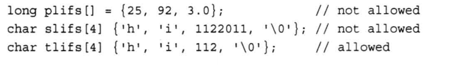
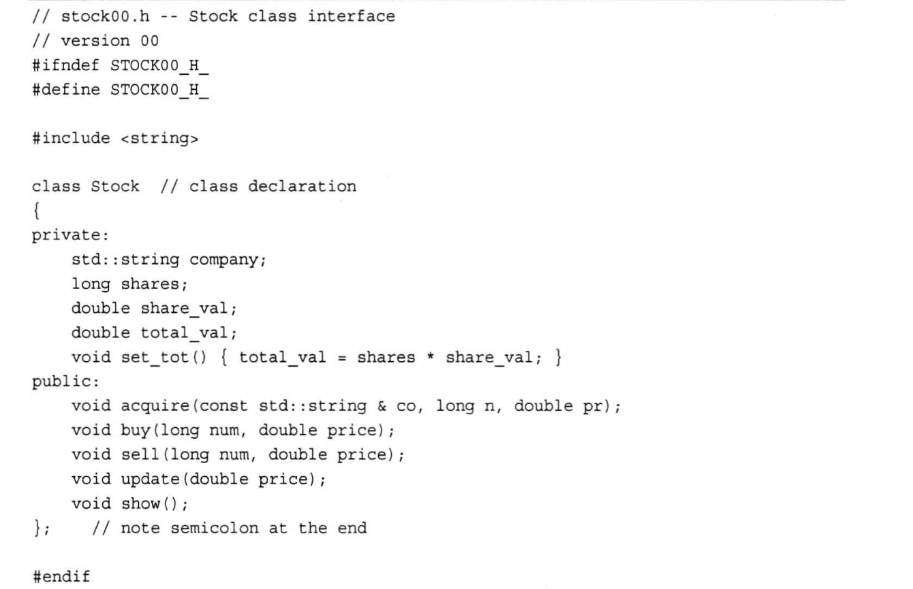
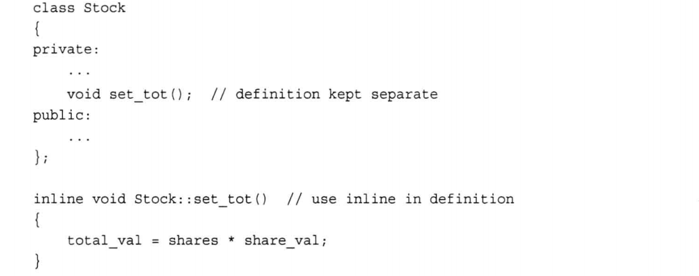

## 函数

| [传值调用](https://www.runoob.com/cplusplus/cpp-function-call-by-value.html) | 该方法把参数的实际值赋值给函数的形式参数。在这种情况下，修改函数内的形式参数对实际参数没有影响。 |
| ------------------------------------------------------------ | ------------------------------------------------------------ |
| [指针调用](https://www.runoob.com/cplusplus/cpp-function-call-by-pointer.html) | 该方法把参数的地址赋值给形式参数。在函数内，该地址用于访问调用中要用到的实际参数。这意味着，修改形式参数会影响实际参数。 |
| [引用调用](https://www.runoob.com/cplusplus/cpp-function-call-by-reference.html) | 该方法把参数的引用赋值给形式参数。在函数内，该引用用于访问调用中要用到的实际参数。这意味着，修改形式参数会影响实际参数。 |

#### 指针调用

```c++
// 函数定义
void swap(int *x, int *y)
{
   int temp;
   temp = *x;    /* 保存地址 x 的值 */
   *x = *y;        /* 把 y 赋值给 x */
   *y = temp;    /* 把 x 赋值给 y */
  
   return;
}

```

#### 引用调用

```c++
// 函数定义
void swap(int &x, int &y)
{
   int temp;
   temp = x; /* 保存地址 x 的值 */
   x = y;    /* 把 y 赋值给 x */
   y = temp; /* 把 x 赋值给 y  */
  
   return;
}
```


```
int swap(int& a, int& b)
{
    int temp;
    temp = a ^ b;
    a = temp ^ a;
    b = temp ^ b;
    return 0;
}
//这里利用了数异或的性质，一个数与其本身异或等于 0，0 与一个数异或不改变该数。


void swap(int& a, int& b) {
    a^=b^=a^=b;
}


```

## 处理数据

### const限定符


使用const关键字来修改变量声明和初始化

```c
const int Months = 12;
```

常量被初始化后，其值就被固定了，编译器将不允许再修改常量的值。

常见的做法将名称首字母大写，以提醒Months是一个常量。

使用#define 创建常量时通常将整个名称大写

C++中，不要使用#define来定义符号常量，应使用const.

c中的const和c++中的稍微有些不同

- 作用域规则
- C++ 可以用const值来声明数值长度


## 符合类型

### 数组

#### 初始化数组规则

```c
//数组只有定义时才能初始化
int cards[4] ={1,3,2,4};
//对一部分数据初始化，编译器会把剩下的元素初始化为0
int hands[4] ={3,66};
//如果不指定数值容量大小，编辑器将计算默认元素个数
int k[]={3,534,1231,0,543};
```

初始化一个全为0的数组很简单那，只需要把第一个元素设置为0

```c
int m[200]={0};
```

#### c++11初始化

***C++11使用大括号的初始化（列表初始化）作为一种通用初始化方式，可以用于所有类型。***

- double ears[4] {1.2e4,1.6e4,1.1e4,1.9e4};

- unsigned int counts[10]={};列表不包含任何东西，将所有元素设置为0

- 列表初始化禁止缩窄转换

  

### 字符串

#### 拼接字符串常量

```c++
    std::cout<<"你好" "明天\n";
    std::cout<<"你好明天\n";
    std::cout<<"你好" 
    "明天\n";

你好明天
你好明天
你好明天
```

任何两个由空白（空格，制表符，和换行符）分隔的字符串，都将自动拼接成一个。

拼接时不会在被连接的字符串之间添加空格，因为字符串的最后一个字符\0字符将被第二个字符串的首字符取代。


### string类


### 结构体

### 共用体

### 枚举

### 指针和自由存储空间

### 指针，数值，和指针算术

### 类型组合

### 数组的替代品


## 类&对象

### 类定义

定义一个类需要使用关键字 **class**，然后指定类的名称，并类的主体是包含在一对花括号中，主体包含类的成员变量和成员函数。

定义一个类，本质上是定义一个数据类型的蓝图，它定义了类的对象包括了什么，以及可以在这个对象上执行哪些操作。


一般来说，类规范有两个部分组成

- 类声明：**以数据成员的方式，描述数据部分，以方法的方式描述公有接口**
- 类方法定义： 描述如何实现方法

**简单来说，类声明提供了类的蓝图，而方法定义提供了细节。**

通常，将接口（类定义）放在头文件中，并将实现放在源代码文件中

```c++
//box.h头文件
#pragma once
class Box //类声明
{
private:
    double length;  // 长度
    double breadth; // 宽度
    double heigth;  // 高度
public:
    Box(/* args */);
    ~Box();
    // 成员函数声明
    double get(void);
    void set(double length, double breadth, double heigth);
};
```

C++中，类对象的默认访问控制是private，

### 类与结构体

类描述看上去很像是包含成员函数以及public 和private可见性标签的结构体声明。

实际上C++对结构体进行了扩展，使之具有类相同的特性

在原理上，他们没有任何区别。C++内部仍然存在struct 原因在于，保持C语言的兼容性。

C++ 中的类和结构体之间的主要区别在于默认的成员访问权限。在类中，默认的成员访问权限是私有（private），而在结构体中默认的成员访问权限是公共（public）。这意味着在结构体中的成员函数和成员变量默认是公共的，可以从结构体外部访问。在类中，它们默认是私有的。你可以使用 `class` 关键字定义类，并在其中包含私有成员

**通常使用类来实现类描述，而把结构限制为只标识纯粹的数据对象（被称为POD,Plain Old Data，老式数据结构）**


### 实现成员函数

和常规函数定义非常相似，但有两个特征：

- 定义成员函数时，使用作用域解析运算符（::）来标识函数所属的类；
- 类方法可以访问类的private组件

```c++
#include <iostream>
#include "include/Box.h"


Box::Box(/* args */)
{
}

Box::~Box()
{
}

double Box::get(void)
{
    return length * breadth * heigth;
}

void Box::set(double length, double breadth, double heigth)
{
    this->length = length;
    this->breadth = breadth;
    this->heigth = heigth;
    
}
```

### 内联方法

**定义**位于**类声明中的函数**都将自动称为内联函数



set_tot就是个内联函数。类声明常将短小的成员函数作为内联函数，set_tot符合这样的要求。也可以在类声明之外定义成员函数（使用inline限定符即可），并使其成为内联函数。




### 构造函数，析构函数

### const成员函数

