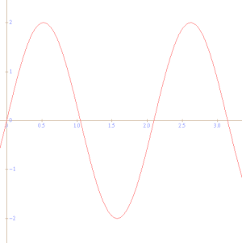
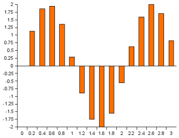
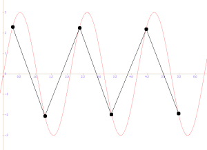

# VoIP

VoIP通过计算机网络发送数字化语音，那么我们如何将将声音转化成数字呢？

当转化一个模拟信号（可以是语音，或者噪声），你需要考虑两个重要的因素

- 采样  sampling
- 量化  quantization

它们共同决定了数字化声音的质量。

上面这个图是模拟信号

将数字化形式显示为一系列离散的样本

## 量化

量化是指用多少比特来表示单个声音样本。在实践中，我们希望使用完整的字节，因此我们考虑使用 8 或 16 位

通过 8 位采样，每个采样可以代表 256 个不同的值，因此我们可以处理 -128 到 +127 之间的整数。由于是整数，我们在将信号转换为数字采样时不可避免地会引入一些噪声。例如，如果精确的模拟值是 "7.44125"，我们就将其表示为 "7"。在对序列中的每个采样进行处理时，我们会对信号进行轻微的扭曲，换句话说，就是注入噪声。

事实证明，8 位采样的质量并不好。由于只有 256 个采样值，模数转换会增加太多噪音。如果改用 16 位采样，情况就会大为改观，因为 16 位可以提供 65536 种不同的表示（从 -32768 到 +32767）。16 位采样就是 CD 上的采样，也是 VoIP 编解码器的输入

## 采样

既然我们已经确定了使用的采样大小（16 位），那就来看看采样率吧。下表列出了三种常用的采样率：

| Type             | Transmitted Bandwidth | Sampling Frequency |
| :--------------- | :-------------------- | :----------------- |
| Telephone Speech | 300-3400 Hz           | 8 kHz              |
| Wide Band Speech | 50-7000 Hz            | 16 kHz             |
| CD quality audio | 20-20000 Hz           | 44.1 kHz           |

### 电子通信中的带宽

在电子通信领域，带宽通常指的是信号传输的频率范围，即信号中包含的频率的范围。带宽决定了信号能够传输的信息量，通常用赫兹（Hz）作为单位。带宽越高，信号携带的信息量就越大，传输速度也就越快。

例如，对于模拟电话线路，其带宽通常在几千赫兹到几万赫兹之间。而对于数字通信，带宽可能涉及到数字信号的频率范围，通常以比特率（每秒传输的比特数）来衡量。

### 计算网络中的带宽

在计算网络中，带宽通常指的是网络连接的传输能力，即在单位时间内从一个点到另一个点传输的数据量。计算网络的带宽通常以比特率（bits per second，bps）或字节率（bytes per second）来表示。

网络带宽影响数据传输的速度和效率。如果网络带宽较小，数据传输速度就会减慢，导致网络延迟。网络带宽的测量通常包括上传带宽和下载带宽，分别表示从本地设备发送到网络和从网络接收到本地设备的数据速率。

综上所述，电子通信中的带宽关注信号的频率范围，而计算网络中的带宽关注数据传输的速率。两者都是在不同上下文中使用的概念，但都涉及到信息传输和数据交流的方面。

**采样频率的选择与信号的频率范围有关。**根据奈奎斯特定理（Nyquist Theorem），为了准确地还原一个信号，采样频率应该至少是信号中最高频率的两倍。因此，如果信号的最高频率是4 kHz，那么8 kHz的采样频率就足够了。

正弦波代表原始模拟声音。大黑点是我们读取采样的位置。请注意，我们在每个周期采样两次，即采样率是声音频率的两倍。这是能让我们重建仍可理解的信号的绝对最小值。这当然不是高保真的声音，但它的频率是正确的

VoIP 最常使用 8 kHz 的采样频率，每个样本存储在 16 位中。 也就是说需要128kbit/s的网络传输带宽，这是仅仅是单向的所需要的

## 音频编解码概述

一旦我们将音频信号表示为样本序列，下一步是对其进行**压缩**，以减少向接收方传输语音所需的网络带宽消耗。

压缩和解压缩由我们称之为编解码器（CODEC）的特殊算法处理。让我们来看看 IP 语音中常用的一些编解码器。我们在此列出的所有编解码器都希望输入的音频采样频率为 8 kHz，采样位数为 16 位。

>MOS 是 "Mean Opinion Score "的缩写。MOS 衡量的是音频经特定编解码器压缩、传输和解压缩后的感知质量。该分数由一组听众按照 ITU-T 标准 P.800 和 P.830 中规定的程序进行评分

**5:极好  4：好  3:一般 2：差  1：糟糕**

### G.711

G.711 是国际电信联盟于 1972 年推出的一种编解码器，用于数字电话，即 ISDN、T.1 和 E.1 链路。该编解码器有两种变体： A-Law 用于欧洲和国际电话链路，u-Law 用于美国和日本。
G.711 采用对数压缩。它将每个 16 位采样压缩为 8 位，因此压缩比为 1:2。由此产生的比特率为单向 64 kbit/s，因此一次通话消耗 128 kbit/s（外加一些数据包头开销）。与其他编解码器相比，这是一个相当大的数字。
这种编解码器可以在 VoIP 应用中自由使用，因为不需要支付许可费。在带宽充足的局域网中使用效果最佳。它的优点包括实现简单，不需要太多的 CPU 能力（可通过相对简单的查表实现），而且音频质量非常好 - MOS 值为 4.2。

### G.729

G.729 是一种带宽要求低但音频质量好（MOS = 4.0）的编解码器。该编解码器以帧为单位对音频进行编码，每帧 10 毫秒。鉴于采样频率为 8 kHz，10 毫秒的帧包含 80 个音频样本。编解码器算法将每帧编码为 10 个字节，因此单向比特率为 8 kbit/s。
在 VoIP 中使用时，我们通常在每个数据包中发送 3-6 个 G.729 帧。这样做是因为数据包头（IP、UDP 和 RTP 加在一起）的开销为 40 字节，我们希望提高 "有用 "信息的比例。
G.729 是一种特许编解码器。就终端用户而言，使用 G.729 的最便捷途径是购买能实现 G.729 的硬件（无论是 VoIP 电话还是网关）。在这种情况下，设备所用芯片的生产商已经支付了许可费。
G.729 的一个常用变体是 G.729a。它与原始编解码器有线兼容，但对 CPU 的要求较低。

### GSM 06.10

GSM 06.10（又称 GSM 全速率）是欧洲电信标准协会设计的一种编解码器，用于 GSM 移动网络。GSM 编解码器的这一变体可以自由使用，因此在开源 VoIP 应用程序中经常可以看到它的身影。该编解码器的音频帧长为 20 毫秒（即 160 个采样点），每帧压缩为 33 个字节，因此比特率为 13 kbit/s（准确地说，编码帧正好是 32 又 1/2 个字节，因此每帧有 4 个比特未使用）。编解码器的平均意见分值为 3.7。

### Speex

Speex 是 Xiph.org 基金会设计的一款开源无专利编解码器。它的设计工作采样率为 8 kHz、16 kHz 和 32 kHz，可将音频信号压缩为 2 至 44 kbit/s 的比特率。用于网络电话时，最常用的是 8 kHz（窄带）变体。

### iLBC

iLBC（互联网低比特率编解码器）是由 Global IP Solutions（后被谷歌收购）开发的一种免费编解码器。该编解码器在 RFC3951 中进行了定义。使用 iLBC，您可以选择使用 20 毫秒或 30 毫秒的帧，由此产生的比特率分别为 15.2 kbit/s 和 13.33 kbit/s。与 Speex 和 GSM 06.10 一样，您可以在许多开源 VoIP 应用程序中找到 iLBC。

## 编解码器延迟与带宽优化

正如我们在编解码器概述中所显示的，低带宽编解码器的效率相当高。例如，G.729 可将 10 毫秒的音频压缩到 10 个字节，G.723.1 可将 30 毫秒的帧编码到 24 或 20 个字节。

不过，由于我们将压缩音频帧作为 RTP 数据包的有效载荷发送，而 RTP 数据包又通过 UDP 发送，因此我们需要考虑 IP、UDP 和 RTP 头的开销。每个数据包的开销为 **40** 字节。如果我们不在局域网上，带宽又有限，那么与压缩音频帧的大小相比，这个开销就非常大了。下表显示了几种低带宽编解码器的开销。对于 G.723.1 和 GSM，我是按每个数据包一帧来计算的；对于 G.729，我是按每个数据包三帧来计算的，因为这种编解码器的帧大小只有 10 毫秒。

## RTP(Real Time Protocol)

在传输数据流时，协议需要处理网络中的以下情况：

- 网络可能会取消数据包顺序

- 某些数据包可能丢失

- 引入抖动（抖动是数据包到达间隔时间的方差）。

  在这三个问题中，RTP 只想解决两个问题，即数据包去序和抖动（使用序列号和时间戳）。说到数据包丢失，该协议更倾向于 "实时性 "而不是可靠性。如果某些数据包丢失了，那就丢失吧，实时传输流更重要。因此，RTP 是在 UDP 的基础上工作的。TCP 因其重传方案而不适合实时协议。

### 头部

### RTCP (Real Time Control Protocol)

