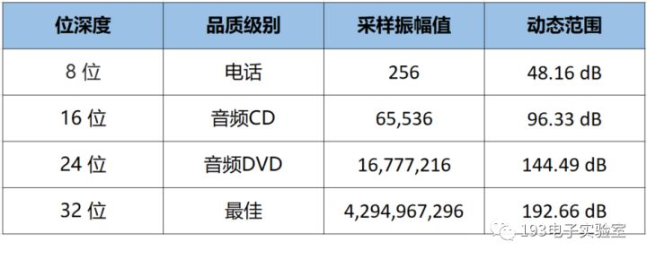
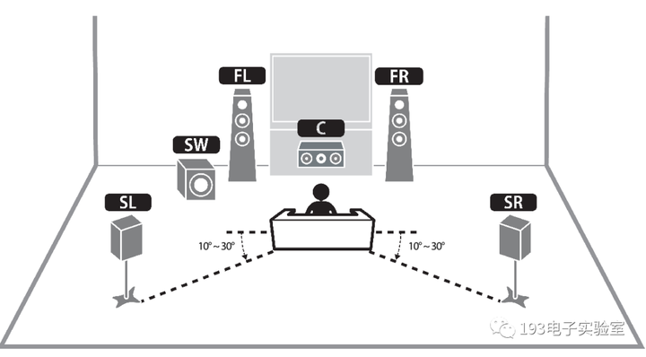

## 1 模拟信号的数字化方法：PCM

### **1.1 PCM的定义**

最基本的概念：**模拟信号**是指随时间连续变化的物理量，将声音在磁带上记录成磁场强度的变化或在黑胶唱片上记录成沟槽大小的变化就是以模拟方式进行存储。**数字信号**则是离散的，计算机中的数据都是以数字方式存储的。模拟信号和数字信号可以相互转换，这里我们讨论的就是把模拟信号转换成数字信号。

**脉冲编码调制（Pulse Code Modulation, PCM）是一种模拟信号的数字化方法。**它是最常用、最简单的波形编码方式，但是也存在其它方法，比如脉冲密度调制（Pulse Density Modulation, PDM）。

### **1.2 PCM的实现过程**

下图就是脉冲编码调制的完整过程，简单概括为：**采样，量化，编码**。

具体来说就是：

1，将模拟信号按照同样的时间间距（即采样时间）进行采样。

2，按某种运算法确定样本值，即量化。

3，将样本值用二进制表示，即编码。

由上可见，脉冲编码调制实际上并没有"调制"的过程，而且也并没有脉冲出现，只因为PCM来源于PWM和PPM技术，所以也保留了"脉冲"二字。所以将脉冲编码调制（PCM）理解为"一种模拟信号的数字化方法"是最准确的。

## 2 数字音频基础概念

### **2.1 采样率 Sample Rate**

**采样率**（采样频率）即**每秒内进行采样的次数**。符号是fs，单位是Hz。采样率越高，数字波形的形状就越接近原始模拟波形，声音的还原就越真实。

如下是同一波形的两种采样率对比，可以看到低采样率的A采样波形严重失真，而高采样率的B则几乎完全重现原始波形：

根据奈奎斯特－香农**采样定理**，只有采样频率高于原始模拟信号中最高频率的**两倍**时，才能把数字信号表示的模拟信号准确还原回去。例如，CD 的采样率为每秒 44,100 个采样，因此可重现最高为 22,050 Hz 的频率，此频率刚好超过人类的听力极限 20,000 Hz。实际应用中采样频率一般为信号最高频率的2.56～4倍。

数字音频领域常用的采样率如下表：

### **2.2 采样位数 Bit Depth**

**采样位数**（又称**位宽，位深，位深度**），字面意义就是**采样值的二进制编码的位数。**采样位数反应了采样系统对声音的辨析度，位数越高，对声音的记录就越精细，所以也称之为**采样精度，采样深度**。

采样位数的含义是**用多少个点来描述声音信号的强度**，如1.2节的PCM编码的位数就是3bit，即有2^3 = 8个点。如果是8bit，就有2^8 = 256个点。

采样位数直接影响采集信号的信噪比/动态范围。较高的采样位数可提供更多可能的振幅值，产生更大的动态范围、更低的噪声基准和更高的保真度。

总结一下，采样率是相对于时间来说的，采样位数是相对信号的幅度来说的，在1.2节中分别对应横坐标和纵坐标。

### **2.3 声道 Sound Channel**

**声道**是指声音在录制或播放时在不同空间位置采集或回放的相互独立的音频信号，通俗的说**声道数就是录音时的麦克风数量，也是播放时的音响数量。**声道数，也叫**通道数，轨道数，音轨数**。

常见的声道数有单声道（Mono），双声道（即立体声，Stereo），5.1声道，7.1声道等。这里的 .1声道指的是低音声道。

如下是一个5.1声道家庭影院示意图，六个扬声器分别是 ：C（Central）中置，FL（Front Left）左前置，FR（Front Right）右前置，SL（Surround Left）左环绕，SR（Surround Right）右环绕和SW（Subwoofer）低音炮。

### **2.4 比特率 Bit Rate**

比特是由bit音译而来，指二进制数中的**位**，它是数字信息的最小度量单位。

在通信与计算领域，比特率就是**指每秒传送或处理的比特的数量（位数）**，所以比特率又称为"**二进制位速率**"，简称"**位速或位率**"，常用于形容传输速度，带宽。

在数字多媒体领域，比特率是**每秒播放连续的音频或视频的比特的数量**，是音视频文件的一个属性。此时它相当于术语"**数字带宽消耗量或吞吐量**"，也俗称为"**码率**"。

比特率的统一含义是"**二进制码数量/时间"**，单位是比特每秒，bit per second，缩写为bit/s（不是"bits/s"），简写为bps或b/s。有一些不正式的描述比如"128千比特音频流"或"100兆比特网络"则是省略了"每秒"。

常用比特率的表述：

