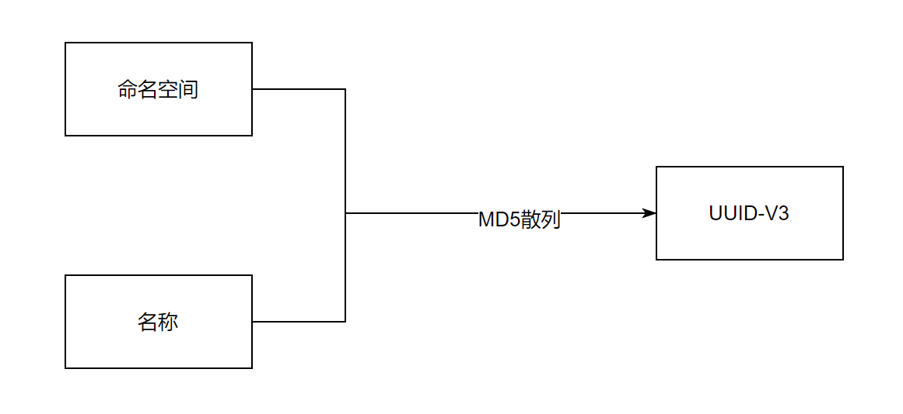

这篇文章将介绍`UUID`从`V1`到`V5`的差异以及该如何选择正确的版本。


###  UUID 是什么

通用唯一识别码（全称：`Universally Unique Identifier`，简称：`UUID`）是用来在系统中唯一标识某条信息的`128`位标识码。

根据标准（[RFC 4122  (opens new window)](https://www.ietf.org/rfc/rfc4122.txt)）,`UUID`的生成不依赖外部服务， 且具有唯一性（注：重复概率几乎为零）。

`UUID`有`16`进制的`32`个数字组成，故理论上总量为`16^32`,即使每纳秒生成一万亿个，也好耗尽壹佰亿年才能强所有`UUID`用完。

### UUID 的结构


`UUID`包含`32`个`16`进制数字，分为`5`段，`5`段长度分别为`8`、`4`、`4`、`4`、`12`，中间使用连字符连接。

例如：`xxxxxxxx-xxxx-Mxxx-xxxx-xxxxxxxxxxxx`

其中`M`表示 `UUID`的版本,从 [uuid生成  (opens new window)](https://devtool.tech/uuid) 可以看出，`M`位置的值和版本是一致的。

各段含义如下：

| 名称                               | 长度 （字节） | 长度（16进制数字码长） | 说明                                                 |
| ---------------------------------- | ------------- | ---------------------- | ---------------------------------------------------- |
| time_low                           | 4             | 8                      | 整数：低位 32 bits 时间                              |
| time_mid                           | 2             | 4                      | 整数：中间位 16 bits 时间                            |
| time_hi_and_version                | 2             | 4                      | 最高有效位中的 4 bits“版本”，后面是高 12 bits 的时间 |
| clock_seq_hi_and_res clock_seq_low | 2             | 4                      | 最高有效位为 1-3 bits“变体”，后跟13-15 bits 时钟序列 |
| node                               | 6             | 12                     | 48 bits 节点 ID                                      |

### V1

`UUID-V1` 是通过使用主机 `MAC` 地址和当前日期和时间的组合生成的。除此之外，它还引入了另一个随机组件，以确保其唯一性。 但是如果使用同一台机器、同时时间生成`UUID`，会有很小的几率重复。


`UUID-v1`存在的问题是：

1. 存在重复几率
2. 根据`ID`能推算出创建时的相对时间
3. 根据`ID`能推算出创建的机器唯一标识

### V2

`UUID-v2`和`V1`很类似，是根据标识符（通常是组或用户`ID`）、时间和节点`ID`生成，不过区别在于`V2`将`V1`中的部分时间信息换成了主机名， 故应用具有局限性（有隐私风险），未大规模使用。

### V3

`UUID-v3` 通过散列（`MD5`）名字空间（`namespace`）标识符和名称生成。和`V1`、`V2`不同，`V3`不依赖与机器信息和时间信息， 但是`V3`要求输入命名空间+名称，命名空间本身也是一个`UUID`，用来标识应用环境，名称通常是用户账号、用户名之类的内容，通过命名空间+名称+三列算法算出`UUID`。



### V4

`UUID-v4` 组成 `UUID v4` 的位是随机生成的，没有固有逻辑（除了第三段首个数字，该数字标识版本号），不包含命名空间、设备信息、时间信息。 故，`UUID-v4`最容易理解、应用也最为广泛。


java` 生成 `UUID-V4

```java
String uuid = UUID.randomUUID();
```

UUID v4 的生成是使用随机数作为源。 Java 是用 SecureRandom （使用不可预测的值作为种子来生成随机数以减少冲突的可能性） 来实现。
Java 生成 UUID v4 非常简单：

```java
UUID uuid = UUID.randomUUID();
```

我们也可以使用 SHA-256 加上随机的 UUID 来使用：

```java
MessageDigest salt = MessageDigest.getInstance("SHA-256");
salt.update(UUID.randomUUID().toString().getBytes("UTF-8"));
String digest = bytesToHex(salt.digest());
```

`js` 生成 `UUID-v4` 参考[https://www.npmjs.com/package/uuidv4  (opens new window)](https://www.npmjs.com/package/uuidv4)

### V5

`UUID-v5` 和`V3`类似，区别在于散列算法，使用了`sha1`散列算法。


> 注：相同的命名空间、名称，将映射到同一`UUID`，且推荐使用`V5`而非`V3`

具体实现可参考 [UUID5  (opens new window)](https://github.com/rootsdev/polygenea/blob/master/java/src/org/rootsdev/polygenea/UUID5.java)

### 如何选择

`V4`是随机`ID`，其他都不是，故：正常情况下直接选择`UUID-V4`就可以了，如果需要根据`ID`给出创建时间、机器信息等内容的话， 选择`V1`比较合适，如果还有特殊情况，需要根据已有信息衍生出新的`ID`，可以使用`V5`。

V4 - 首选

V1 - 如果需要反向解析主机 Mac 地址

V5 - 如果需要根据特定的值生成，而且在值不变的情况下生成的 UUID 不变。
 可用于加密用户密码，比如我的密码是 123456，sha1 固定为`7c4a8d09ca3762af61e59520943dc26494f8941b`，所以一旦数据库数据泄露，很容易枚举出简单的密码原文。但使用 v5 算法后加入了特定的 namespace，会得到完全不同，切不具备普遍性的 UUID 串，这样就很难破解出密码原文了。

V3 - 不推荐，用 V5 替代

V2 - 一般不会用到