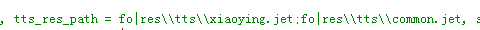

## 讯飞离线文转语资源设置

**windows/Linux ** **平台离线资源路径设置的问题：**

如下图文档所示，离线资源加载路径既可以设置成相对路径也可以设置成绝对路径。

1.相对路径的设置方式参考sdk中demo，如下：




2.绝对路径的设置方式,例如：

```tex
tts_res_path = fo|C:\\Users\\Administrator\\Desktop\\msc\\res\\tts\\xiaoyan.jet.
```


